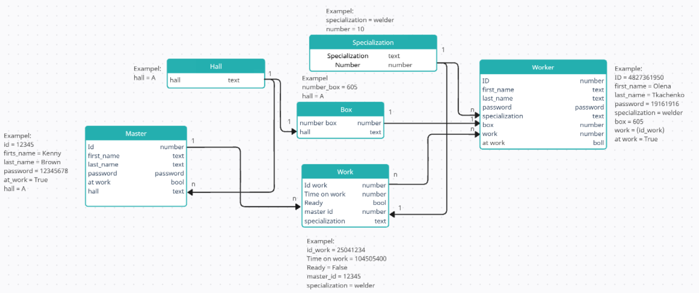
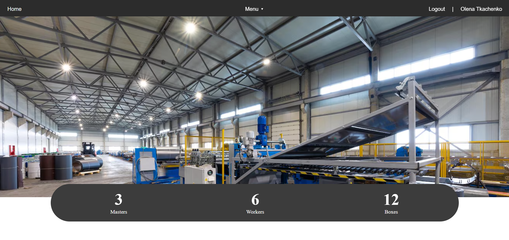
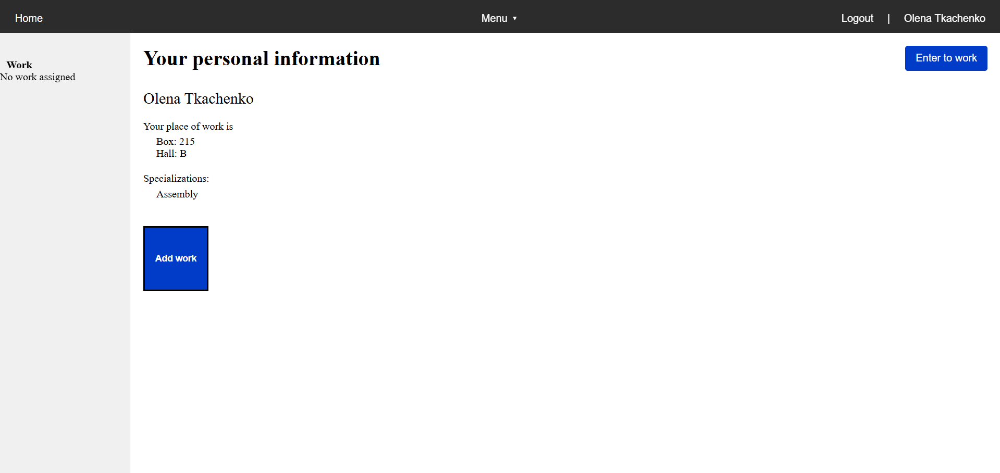

🏭 Factory Task Management

1. Project Overview

Factory Task Management is a Django-based web application designed to organize and manage workflow processes in a factory setting.

The system allows workers and masters to view their current tasks, accept or remove them, and change their completion status.

DB structure:



Home page:



Personal page:



2. Functionality

Implemented:

- Worker authentication using worker_id and password

- Personal profile with work location details

- Add a work task using id_work (with validation)

- Work detail page with functionality to remove or mark as completed

Planned:

- Separate roles and pages for masters

- Work status tracking, filters, and analytics

- Advanced validation and status tracking system

3. Quick Start

Installation:

```bash
pip install -r requirements.txt

Migrations and Server Start:

python manage.py makemigrations
python manage.py migrate
python manage.py runserver
```

🔐 Disclaimer: Database Included

This project includes a pre-populated SQLite database (db.sqlite3) to simplify review and demonstration.

- All accounts are test worker accounts

- Each account has the same password: 19161916

- You can log in using any worker's ID listed in the database

- Masters are not yet integrated into the system

If you wish to start with a fresh database, feel free to delete db.sqlite3 and run migrations.