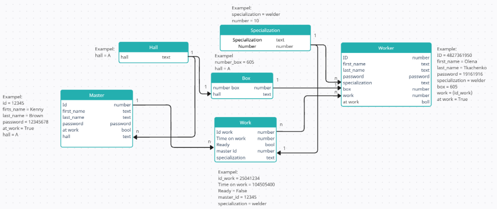
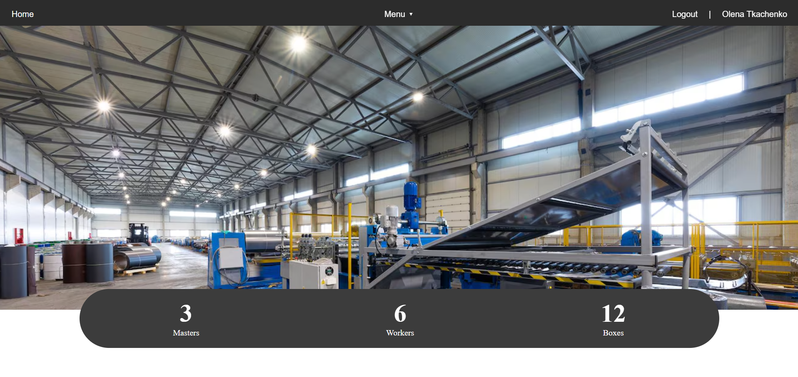
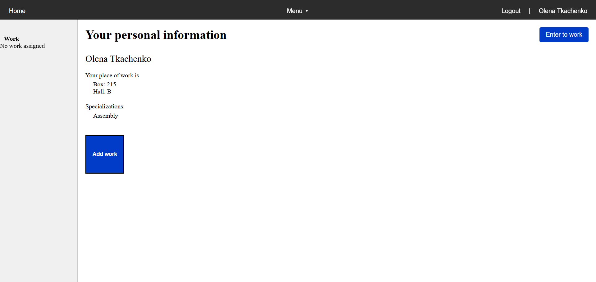

🏭 Factory Task Management

1. Project Overview

Factory Task Management is a Django-based web application designed to organize and manage workflow processes in a factory setting.

The system allows workers and masters to view their current tasks, accept or remove them, and change their completion status.

DB structure:



Home page:



Personal page:



2. Functionality

Implemented:

- Worker authentication using worker_id and password

- Personal profile with work location details

- Add a work task using id_work (with validation)

- Work detail page with functionality to remove or mark as completed

Planned:

- Separate roles and pages for masters

- Work status tracking, filters, and analytics

- Advanced validation and status tracking system

3. Quick Start

Installation:

```bash
pip install -r requirements.txt

python manage.py makemigrations
python manage.py migrate
python manage.py runserver
```

## 🚀 Deployed Project

[Click here to view the deployed app](https://factory-task.onrender.com)

🧪 Test User
You can use the following test user to log in and explore the application:

Required:

🆔 Worker ID: 4827361950

🔑 Password: user12345

Optional:

👤 First Name: User_name

👥 Last Name: Last_name